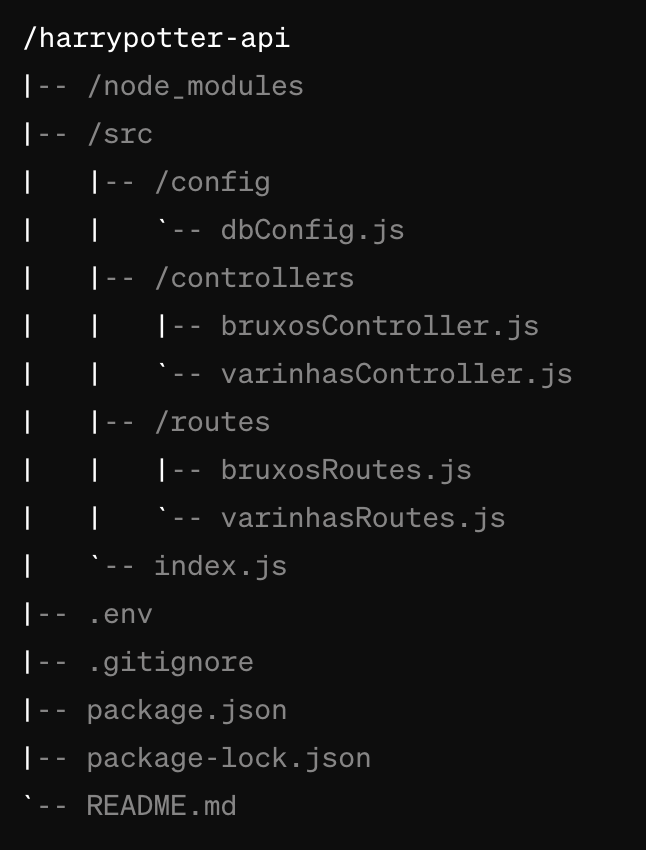

# Mundo de Harry Potter 🧙🏼🪄

Bem-vindo ao Mundo de Harry Potter - Backend! Este projeto é parte de um desafio de desenvolvimento backend inspirado no mundo mágico criado por J.K. Rowling. Aqui, você encontrará um backend simples desenvolvido em Node.js com Express e PostgreSQL, permitindo operações CRUD completas para bruxos e varinhas.


## Funcionalidades🪄

- Criação, leitura, atualização e exclusão (CRUD) de bruxos.
- Criação, leitura, atualização e exclusão (CRUD) de varinhas.
- Rota de teste que retorna uma frase aleatória do filme Harry Potter ou um feitiço.

## Tecnologias Utilizadas🪄

- Node.js
- Express
- PostgreSQL
- dotenv


## Como Usar🪄

1. Clone este repositório:

```
git clone https://github.com/thiago-rferreira/atividade-harrypotter_v2.git
```

2. Instale as dependências:

```
cd harry-potter-backend
npm install
```

3. Configure o banco de dados PostgreSQL:

   - Certifique-se de ter o PostgreSQL instalado em sua máquina.
   - Crie um banco de dados chamado `harrypotter`.
   - Execute o script fornecido em `database.sql` para criar as tabelas `bruxos` e `varinhas`.

4. Configure as credenciais do banco de dados:

   - No arquivo `index.js`, altere as informações de conexão do pool do PostgreSQL para corresponder às suas credenciais.

5. Inicie o servidor:

```
npm start
```

6. Acesse a API em `http://localhost:3003`.

## Rotas 🪄

- `GET /bruxos`: Retorna todos os bruxos.
- `POST /bruxos`: Cria um novo bruxo.
- `PUT /bruxos/:id`: Atualiza um bruxo existente.
- `DELETE /bruxos/:id`: Deleta um bruxo existente.
- `GET /varinhas`: Retorna todas as varinhas.
- `POST /varinhas`: Cria uma nova varinha.
- `PUT /varinhas/:id`: Atualiza uma varinha existente.
- `DELETE /varinhas/:id`: Deleta uma varinha existente.
- `GET /`: Retorna uma frase aleatória do filme Harry Potter ou um feitiço.


## Estrutura de pastas 🪄


## Contribuindo

Contribuições são bem-vindas! Sinta-se à vontade para abrir issues ou enviar pull requests para melhorar este projeto.

### Aviso Importante

Os dados de acesso ao banco de dados estão expostos neste projeto, pois é destinado a fins educacionais como projeto de estudo para alunos. Certifique-se de não utilizar informações sensíveis neste contexto.

